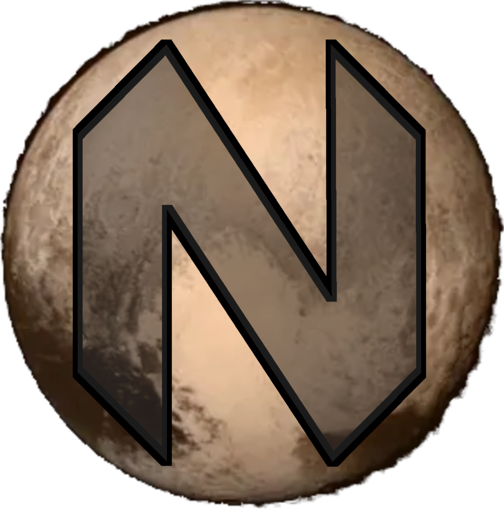
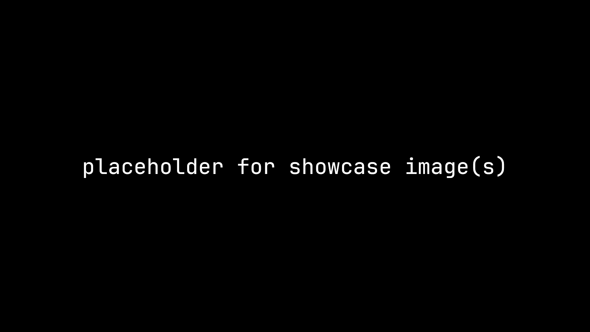

<h1 align="center">
  
  <br>
  PLUTO
  <br>
  
  <div align="center">
    <a href="https://builtwithnix.org/">
      
    </a>
    <a href="https://github.com/kinzokudev/pluto">
      
    </a>
    <a href="https://github.com/kinzokudev/pluto/issues">
      
    </a>
    <a href="https://github.com/kinzokudev/pluto/stargazers">
      
    </a>
    <a href="https://github.com/kinzokudev/pluto/blob/main/.github/LICENCE">
      
    </a>
  </div>
</h1>

## What is PLUTO?

<p>
  PLUTO is a neovim configuration that I made as a companion to be used alongside my NixOS configuration <a href="https://github.com/kinzokudev/nebula">NEBULA</a>.
  <br>
  It is written with user experience in mind and aims to have a smooth workflow with sane defaults.
</p>



<h3 align="center">
  <details>
    <summary>More Images</summary>
    
    
    
  </details>
</h3>

## Features

- sorry, still WIP :3

## Installation

PLUTO can be installed as a package by adding it as an input in your flake:

```nix
{
  inputs = {
    # ...

    pluto = {
      url = "github:kinzokudev/pluto";
    };
  };
}
```

And then import the package in your configuration:

```nix
home.packages = [
  inputs.pluto.packages.${system}.default
];
```

> [!NOTE]\
> If you're interested in a way to install PLUTO using a module for customization, I will be working on that sometime in the near future. Let me know if you have any suggestions! My Discord DMs are open (my username is on my website).

## Contributing/Support

Any support is appreciated and contributions are welcome. You can [open an issue](https://github.com/kinzokudev/pluto/issues) or [submit a pull request](https://github.com/kinzokudev/pluto/pulls).

---

<h3>
  Special Thanks
</h3>

[Ardishco](https://github.com/ardishko), my friend who helped me with some parts of the configuration.

[Nikita](https://github.com/bananad3v), another good friend who also helped with some config stuff. I also stole most of this README from his [Lumi](https://github.com/bananad3v/lumi) configuration repo.

[raf](https://github.com/notashelf), a man who may or may not be a shelf. Thank you for making this epic Neovim configuration framework.
